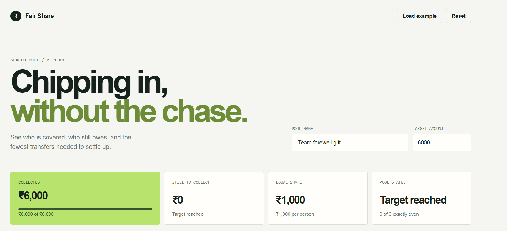
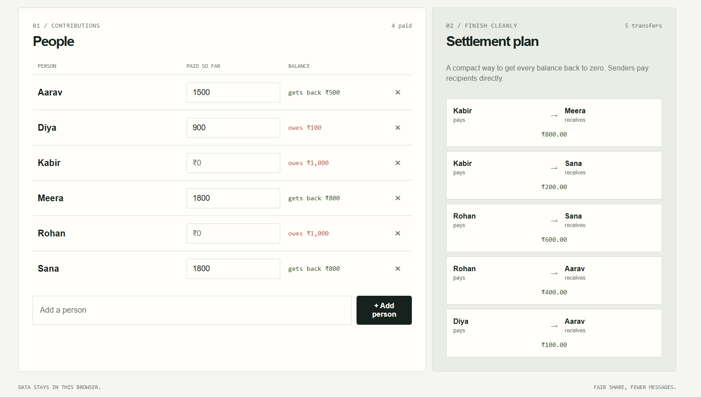

# Fair Share

[Live Demo](https://yesiamvishal.github.io/Auriga-Round-2-project-/)
> A simple shared-expense tracker that turns messy contributions into clear balances and a practical settlement plan.

Fair Share helps an organiser manage a group collection such as a farewell gift, team lunch, trip, or shared subscription. Add the target amount, record what each person has paid, and the app calculates the equal share and who should pay whom.


## Highlights

- Track any shared pool and any number of participants.
- See the total collected, amount remaining, equal share, and pool status at a glance.
- Identify people who owe money, are exactly even, or have paid extra.
- Generate a compact payer-to-recipient settlement plan.
- Keep data across refreshes with browser `localStorage`.
- Use the included example to understand the workflow immediately.
- Run and deploy as a static site with no framework, build tool, or backend.

## Example

For a ₹6,000 pool shared by six people:

```text
Equal share = ₹6,000 ÷ 6 = ₹1,000 per person
```

If one person paid ₹1,500, their balance is `+₹500` and they should receive ₹500 back. If another person paid ₹900, their balance is `-₹100` and they still owe ₹100. Fair Share combines these balances into direct transfers so the group can settle with as few payments as possible.

## Screenshots

### Pool dashboard



### Settlement plan



## Quick start

Fair Share has no dependencies or installation step.

### Run with a local server

From the project root, run:

```bash
python3 -m http.server 8000
```

Open [http://localhost:8000](http://localhost:8000) in a browser.

You can also open `index.html` directly, but a local server provides a closer preview of how the site behaves when deployed.

## How to use

1. Enter a pool name and target amount.
2. Add every participant in the **People** section.
3. Enter each participant's payment in **Paid so far**.
4. Review the summary cards for collection progress and the equal share.
5. Read each person's balance: **owes**, **gets back**, or **all even**.
6. Follow the **Settlement plan** to finish the pool with direct payments.

Use **Load example** to restore the farewell-gift scenario. Use **Reset** to clear the current pool.

## How it works

The app uses equal shares for the first version:

```text
Equal share = target amount ÷ number of people
Balance = amount paid - equal share
```

People with negative balances are debtors. People with positive balances are creditors. The settlement algorithm sorts both groups and repeatedly matches a debtor with a creditor until all balances are settled.

## Data and privacy

The app saves the current pool in the browser's `localStorage` under `fair-share-pool`. This means:

- Refreshing the page keeps the data on the same browser and device.
- No account or server is required.
- Data is not synchronised between devices or shared with other participants.
- Use **Reset**, or run the command below in the browser Console, to clear saved data:

```js
localStorage.removeItem('fair-share-pool');
```

## Deployment

Because this is a static site, it can be hosted on GitHub Pages, Netlify, Vercel, Cloudflare Pages, or any standard web server. Upload the project files and make sure `index.html` is the published entry point.

To publish the latest changes to GitHub:

```bash
git add .
git commit -m "Update Fair Share documentation"
git push origin main
```

## Project structure

| File | Purpose |
| --- | --- |
| `index.html` | Page structure, controls, and accessible labels. |
| `style.css` | Responsive layout, colors, spacing, and visual states. |
| `script.js` | Pool state, calculations, rendering, persistence, and interactions. |
| `screenshots/` | README preview images. |
| `REASONING.md` | Product and implementation reasoning. |
| `AI_LOGS.md` | Conversation log required for evaluation. |

## Scope

The current version intentionally focuses on equal shares and simple balances. Unequal contributions, login, payment links, multi-device collaboration, and a shared backend are possible future extensions, but are outside the scope of this lightweight static implementation.